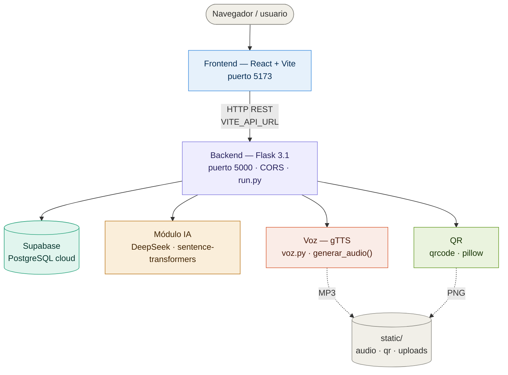

# PROYECTO_DEAD_PRO_FINAL

Aplicación web con **backend Flask** y **frontend React/Vite** para guardar experiencias, imágenes, códigos QR y conversaciones asistidas por IA.

---

## Arquitectura



---

## Estructura del proyecto

```
PROYECTO_DEAD_PRO_FINAL/
├── app/                        # Backend Flask (Application Factory)
├── frontend-react/             # Frontend React + Vite
├── static/                     # Archivos generados en runtime (audio, QR, uploads)
├── tests/                      # Tests automatizados (pytest)
├── run.py                      # Punto de entrada del backend
├── voz.py                      # Módulo de síntesis de voz (gTTS)
├── .env.example                # Variables de entorno (copiar a .env)
├── requirements.txt            # Dependencias base de producción
├── requirements-dev.txt        # Dependencias de desarrollo y tests
├── requirements-ai.txt         # Dependencias ML opcionales (torch, transformers)
├── requirements-voice.txt      # Referencia explícita para voz
├── requirements-loose.txt      # Versiones sin pinear (desarrollo relajado)
├── package.json                # Scripts de orquestación frontend
└── start.bat                   # Arranque rápido en Windows
```

> La carpeta React válida es `frontend-react/`. No usar copias internas como `frontend-react/frontend-react/`.

---

## Configuración

1. Clonar el repositorio:
   ```bash
   git clone https://github.com/richardg91-bien/PROYECTO_DEAD_PRO_FINAL.git
   cd PROYECTO_DEAD_PRO_FINAL
   ```

2. Copiar el archivo de variables de entorno:
   ```bash
   cp .env.example .env
   ```

3. Completar `.env` con tus credenciales:
   | Variable | Descripción |
   |---|---|
   | `SUPABASE_URL` | URL de tu proyecto Supabase |
   | `SUPABASE_KEY` | Clave anon o service de Supabase |
   | `SECRET_KEY` | Secreto largo y aleatorio para Flask |
   | `CORS_ORIGINS` | Orígenes permitidos (separados por coma) |
   | `DEEPSEEK_API_KEY` | Opcional — solo si usas el módulo IA |
   | `FLASK_DEBUG` | `1` en desarrollo, `0` en producción |

---

## Instalación y ejecución

### Backend

```bash
python -m venv venv
venv\Scripts\activate          # Windows
# source venv/bin/activate     # Linux / macOS

pip install -r requirements.txt
# Opcional: módulo IA (instala torch ~2 GB)
# pip install -r requirements-ai.txt

python run.py
# → http://127.0.0.1:5000
```

### Frontend

```bash
cd frontend-react
npm install
npm run dev
# → http://127.0.0.1:5173
```

Para apuntar el frontend a otro backend:

```bash
# frontend-react/.env
VITE_API_URL=http://127.0.0.1:5000
```

### Arranque rápido (Windows)

```bat
start.bat
```

---

## Tests

```bash
pytest -q
```

Con cobertura:

```bash
pytest --cov=app --cov-report=term-missing
```

Si el entorno virtual está roto, recrearlo:

```bash
rmdir /s /q venv
python -m venv venv
venv\Scripts\activate
pip install -r requirements.txt -r requirements-dev.txt
```

---

## Dependencias

| Archivo | Uso |
|---|---|
| `requirements.txt` | Producción — versiones fijas, sin ML pesado |
| `requirements-dev.txt` | Tests — pytest, pytest-flask, pytest-mock |
| `requirements-ai.txt` | Opcional — torch, transformers, sentence-transformers |
| `requirements-voice.txt` | Referencia — gTTS (ya incluido en base) |
| `requirements-loose.txt` | Sin versiones pinadas — para CI o exploración |

---

## Git

No se deben versionar:
- Bases de datos locales (`*.db`)
- Archivos generados en runtime (`static/audio/`, `static/qr/`, `static/uploads/`)
- Entornos virtuales (`venv/`, `venv_ai/`)
- Dependencias de Node (`node_modules/`)
- Variables de entorno (`.env`)
- Build del frontend (`dist/`)

Ver `.gitignore` para la lista completa.

---

## Producción

```bash
FLASK_DEBUG=0
CORS_ORIGINS=https://tu-dominio.com
```

Servir con Gunicorn:

```bash
pip install gunicorn
gunicorn "app:create_app()" --bind 0.0.0.0:5000 --workers 4
```
